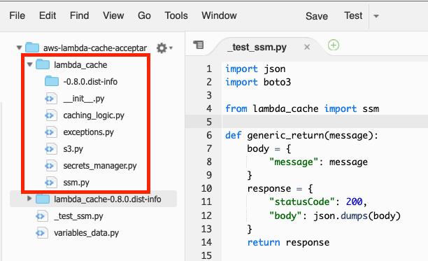

# Installation

Unlike other packages, _lambda_cache_ was designed to operate specifically within an AWS Lambda Function. Hence the installation is slightly more complicated.

There are two general options to using it.

## Manual Installation

Because _lambda-cache_ is a pure python package, you can manually include it in your lambda function, like so:

    $ pip install lambda-cache -t /path/to/function

Once installed you will see the following directory structure in your lambda function via the console:

## Using Serverless Framework

Using [Serverless Framework](https://serverless.com/), and the [serverless-python-requirements](https://serverless.com/plugins/serverless-python-requirements/) plugin, you can include any python package, including _simple_lambda_cache_ into your lambda function.

simply ensure that _simple_lambda_cache_ is part of your `requirements.txt` file:

    $ pip install lambda-cache

## Using the publicly available layer from Klayers

[Klayers](https://github.com/keithrozario/Klayers) is a project that publishes AWS Lambda Layers for public consumption. A Lambda layer is way to pre-package code for easy deployments into any Lambda function.

You can 'install' _lambda_cache_ by simply including the latest layer arn in your lambda function.

